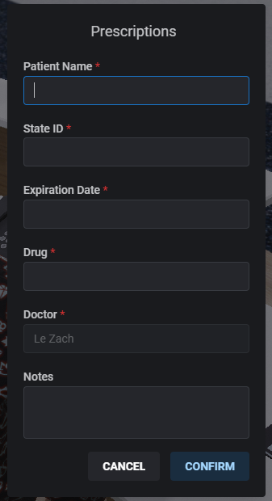
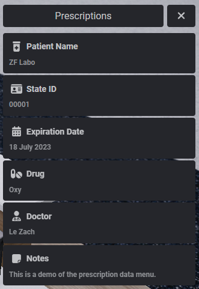

# ZF Labo - Prescriptions
#### Your doctors can now give prescriptions with details for drugs and instructions for patients.
 

## Dependencies
- [zf-lib](https://github.com/zf-labo/zf-lib)
- [ox_lib](https://github.com/overextended/ox_lib)
- [qb-core](https://github.com/QBCore-Framework/qb-core) / [esx](https://github.com/esx-framework/esx_core)


## Installation
1. Download the resource.
2. Extract it in your resource folder.
3. Add `ensure zf-prescriptions` to your server.cfg.
4. Add the Prescription Item to Shared/Items.lua or Database.
5. Add the Prescription Image to your inventory.

## Item Registration
For qb-core
```lua
['prescription'] = {
    ['name'] = 'prescription',
    ['label'] = 'Medical Prescription',
    ['weight'] = 50,
    ['type'] = 'item',
    ['image'] = 'prescription.png',
    ['unique'] = true,
    ['useable'] = true,
    ['shouldClose'] = true,
    ['combinable'] = nil,
    ['description'] = ''
},
```

For ESX
```sql
INSERT INTO `items` (`name`, `label`, `weight`, `rare`, `can_remove`) VALUES ('prescription', 'Prescription', 1, 0, 1);
```